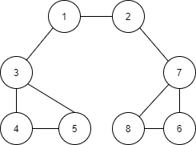

# BFS
* Breadth First Search, 너비 우선 탐색 
* BFS 구현에서는 선입선출 방식인 큐 자료구조를 이용하는 것이 정석이다. 인접한 노드를 반복적으로 큐에 넣으면
자연스럽게 먼저 들어온 것이 먼저 나가게 되어 가까운 노드부터 탐색하게 된다. deque 라이브러리를 사용하는 것이 좋고, 
탐색을 수행하는데 O(N)이 소요된다. 일반적인 경우수행시간은 DFS 보다 좋은 편이다. 
    
    ```py
    from collections import deque

    def bfs(graph, start, visited):
        # 큐 구현을 위해 deque 라이브러리 사용
        queue = deque([start])
        # 현재 노드를 방문 처리
        visited[start] = True
        # 큐가 빌 때까지 반복
        while queue:
            # 큐에서 하나의 원소를 뽑아 출력
            v = queue.popleft()
            print(v, end = ' ')
            # 해당 원소와 연결된, 아직 방문하지 않은 원소들을 큐에 삽입
            for i in graph[v]:
                if not visited[i]:
                    queue.append(i)
                    visited[i] = True 

    # 각 노드가 연결된 정보를 리스트 자료형으로 표현(2차원 리스트)  
    graph =[
        [],
        [2, 3, 8],
        [1, 7],
        [1, 4, 5],
        [3, 5],
        [3, 4],
        [7],
        [2, 6, 8],
        [1, 7]
    ]

    # 각 노드가 방문된 정보를 리스트 자료형으로 표현
    visited = [False] * 9

    bfs(graph, 1, visited)

    # 탐색 순서: 1 2 3 8 7 4 5 6 
    ```
