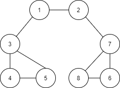

# DFS
* Depth-First Search, 깊이 우선 탐색이라고 부르며, 그래프에서 깊은 부분을 우선적으로 탐색하는 알고리즘
* 그래프의 기본구조: 노드(Node)와 간선(Edge)
* 코딩 테스트에서는 그래프를 2가지 방식으로 표현할 수 있다
  * 인접 행렬(Adjacency Matrix): 2차원 배열로 그래프의 연결 관계를 표현하는 방식
    ```py
    INF = 999999999

    # 2차원 리스트를 이용해 인접 행렬 표현
    graph = [
        [0, 7, 5],
        [7, 0, INF],
        [5, INF, 0]
    ]

    print(graph)
    ```
  * 인접 리스트(Adjacency List): 리스트로 그래프의 연결 관계를 표현하는 방식
    ```py
    # 행(Row)가 3개인 2차원 리스트로 인접 리스트 표현
    graph = [[] for _ in range(3)]
    # 노드 0에 연결된 노드 정보 저장(노드, 거리)
    graph[0].append((1,7))
    graph[0].append((2,5))
    # 노드 1에 연결된 노드 정보 저장(노드, 거리)
    graph[1].append((0,7))
    # 노드 2에 연결된 노드 정보 저장(노드, 거리)    
    graph[2].append((0,5))

    print(graph)
    ```
* 두 방식은 어떤 차이? 메모리 효율은 인접 리스트가 좋지만 특정한 두 노드가 연결되어 있는지 정보를 얻는 속도가 느리다.
어차피 특정한 노드와 연결된 모든 인접 노드를 순회해야된다면, 인접 리스트 방식이 낫다.
    
* DFS는 스택 자료구조에 기초하고 재귀 함수를 이용하면 매우 간결하게 구현할 수 있다. 또한 탐색을 수행하는데 걸리는 시간은 O(N)이다  
    
  ```py
    def dfs(graph, v, visited):
        visited[v] = True
        print(v, end = ' ')
        # 현재 노드와 연결된 다른 노드를 재귀적으로 방문
        for i in graph[v]:
            if not visited[i]:
                dfs(graph, i, visited)

    # 각 노드가 연결된 정보를 리스트 자료형으로 표현(2차원 리스트)  
    graph =[
        [],
        [2, 3, 8],
        [1, 7],
        [1, 4, 5],
        [3, 5],
        [3, 4],
        [7],
        [2, 6, 8],
        [1, 7]
    ]

    # 각 노드가 방문된 정보를 리스트 자료형으로 표현
    visited = [False] * 9

    dfs(graph, 1, visited)

    # 탐색 순서: 1 2 7 6 8 3 4 5 
  ```