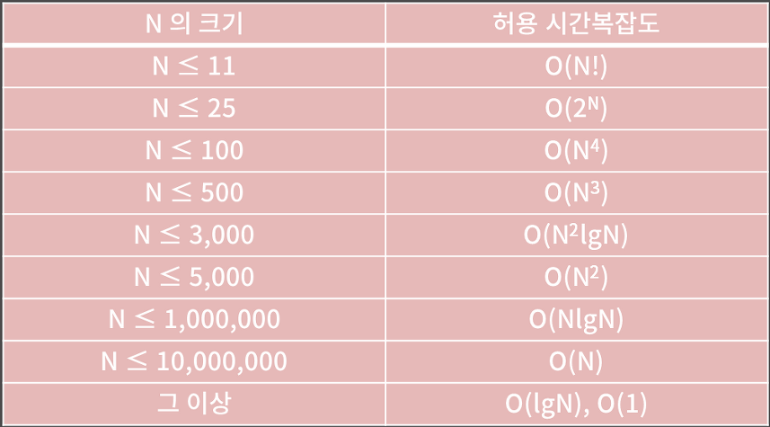

# 시간복잡도 
* 컴퓨터는 1초에 대략 3-5억 개 정도의 연산을 처리할 수 있다. 연산이 비트 AND, OR, 비교, 덧셈과 같은 단순한 연산인지, 아니면 나눗셈, 곱셈, 대입, 함수 호출과 같은 복잡한 연산인지에 따라 횟수에 차이가 날 수 있다. 제한시간이 1초라면 내가 짠 프로그램이 3-5억 번의 연산 안에 답을 내고 종료되어야 함을 말한다.(이 부분이 모호한게 어느 곳에서는 1억 번만 가능하다고 하고, 또 어떤 곳에서는 2천만 번 정도의 연산을 수행한다고 가정하면 된다고 한다. 파이썬 기준으로하면 2천만 번에서 1억 번 사이가 맞는 듯 보인다.)

* 시간복잡도와 입력의 범위


* 자료형이 정해진 프로그래밍 언어 같은 경우 정수 자료형, 실수 자료형이 저장할 수 있는 범위에 대해 신경을 써야한다. 오버플로우 현상으로 인해 예상과는 전혀 다른 결과를 얻을 수 있기 때문이다. 실수를 저장하는 방식은 IEEE-754 format을 따라 sign, exponent, fraction field로 나뉘어서 저장이 된다. sign field는 해당 수가 음수인지 양수인지 저장하고, exponent field는 지수를 저장하고, fraction field는 유효숫자를 저장하는 부분이다. 


* 실수의 성질들
    1. 실수의 저장/연산 과정에서 반드시 오차가 발생할 수 밖에 없다. 그 이유는 fraction field는 유한하기 때문에 이진수 기준으로 0.1과 같이 무한소수인 것을 저장하려면 float은 앞 23bit, double은 앞 52bit까지만 잘라서 저장할 수 밖에 없다. 이를 3번 더하면 오차가 커져서 아래와 같은 결과를 내놓는다. 이 fraction field를 가지고 각 자료형이 어디까지 정확하게 표현할 수 있는지 보면 float은 유효자리가 6자리이고 double은 유효숫자가 15자리이다. 이 말은 곧 원래 참 값이 1이라고 하면 1-10^-15 에서 1+10^15 사이의 값을 가진다는 것을 보장한다는 의미이다. 
        ```cpp
        int main(void){
            if(0.1+0.1+0.1 == 0.3) cout << "true";
            else cout << "no no...";
        }
        /*result는 no no...*/
        ```
    2. double에 longlong 범위의 정수를 함부로 담으면 안된다. 
    3. 실수를 비교할 때는 등호를 사용하면 안된다.

> 출처: https://blog.encrypted.gg/922?category=773649 